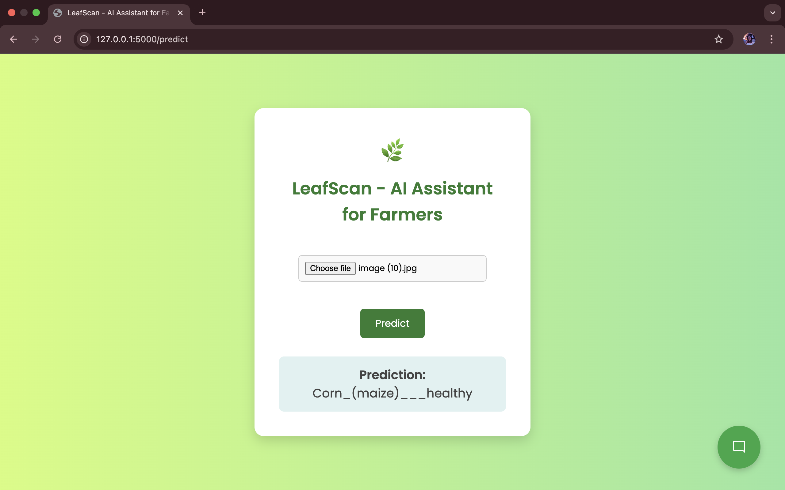

# LeafScan-AI-Assistant-for-Farmers

LeafScan is a deep learning–based web application that helps farmers detect plant diseases through leaf images. Built using ResNet CNN for image classification and Flask for deployment, the app also integrates a smart Chatbot that provides actionable solutions for detected diseases, making it a complete AI assistant for modern farming.

## Tech Stack

- Frontend: HTML, CSS, Bootstrap
- Backend: Flask (Python)
- Deep Learning:ResNet Convolutional Neural Network
- Chatbot:	OpenAI GPT API

